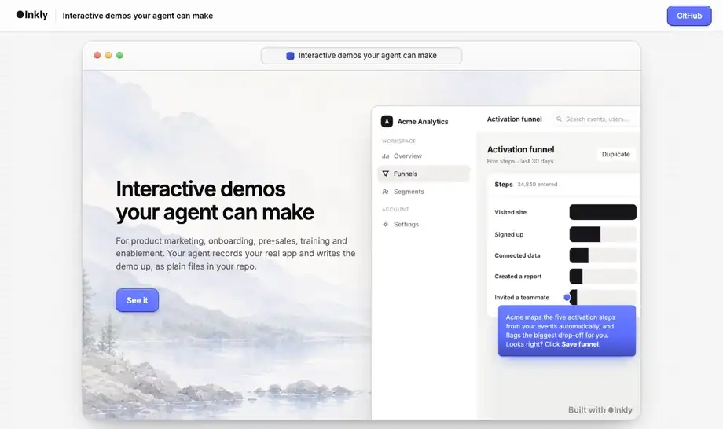
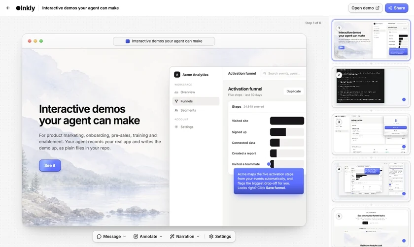

<h1 align="center">interactive-demo</h1>

<p align="center">
  <strong>Agent-native interactive product demos.</strong><br>
  Your agent records, writes and ships them — for product marketing, onboarding, pre-sales, training and enablement.
</p>

<p align="center">
  <a href="https://github.com/inkly-ai/interactive-demo/actions/workflows/ci.yml"></a>
  <a href="https://www.npmjs.com/package/@inkly-org/interactive-demo-cli"></a>
  <a href="LICENSE"></a>
  
</p>

https://github.com/user-attachments/assets/3faa17ec-2030-428d-9047-c277e29866ab

<p align="center"><a href="https://interactive-demo.inklyai.dev/p/AMrDQaVQfiHtHbkRhcI9Ew"><strong>▶ Try the live demo</strong></a> · <a href="https://youtu.be/Mus1gXwJIJU">Watch the launch video on YouTube</a></p>

## What you get

Screenshots or short clips of your real product, with hotspots on top,
playing as a click-through a viewer drives themselves — kept as plain files
your agent can make and maintain.



<p align="center"><em>Every screen above is real: a Claude Code session using this repo's skill, this CLI, this editor.<br>
It lives in <a href="examples/showcase">examples/showcase</a>, whose screens are re-shot by <code>node testbed/shoot-showcase.mjs</code> and this animation by <code>npm run hero</code>.</em></p>

- **Your agent does the work.** The [agent skill](skills/interactive-demo/SKILL.md) in this repo
  teaches Claude Code, Codex or another agent the whole loop: scaffold,
  capture, write the copy, validate, publish. Ask for "a demo of our
  onboarding flow" and review what comes back.
- **Plain files in your repo.** A demo is a `demo.config.json` and an
  `assets/` folder, with no manifest to keep in step. Your agent edits it like any
  other file, the diff is reviewable, and when the product changes it can
  re-capture the screens and fix the copy.
- **Capture two ways.** From the terminal, `capture start` opens Chrome and
  every click becomes a step, with the pointer where you clicked; scroll or
  type before a click and that step is a short video instead. Or record in
  your own browser with the
  [Chrome extension](https://docs.inklyai.dev/open-source/capture#the-chrome-extension)
  and import the zip.
- **An editor for the humans.** `dev` serves a local editor that writes
  straight back to the same files: hotspots, zoom, blur, covers, voiceover.
- **One command to a link — or host it yourself.** `publish` puts the demo
  online and prints its URL; publishing again updates the same link, so
  embeds keep working. `build` writes a self-contained folder for any static
  host instead. Nothing in it phones home, and the embed snippets are
  identical either way — only the origin differs.
- **A React component too.** `<Demo>` and `<DemoModal>`, if your site is React.

## Quickstart

```sh
npx @inkly-org/interactive-demo-cli init my-demos
cd my-demos && npm install
```

**Let your agent make it.** Give it the [skill](skills/interactive-demo/SKILL.md)
— for Claude Code, copy it to `.claude/skills/interactive-demo/SKILL.md` in
the project — and ask:

```
Make an interactive demo of our onboarding flow at https://app.example.com
```

**Or record it yourself** (needs Google Chrome — see [requirements](#requirements)):

```sh
npx interactive-demo capture start https://app.example.com --name "Onboarding"
# click through the product in the window that opens
npx interactive-demo capture stop
```

**Write it up.** Capture gives you structure, not writing — the words on each
step are the demo. Your agent edits `demo.config.json`; you can use the editor:

```sh
npm run dev     # preview on :3000, editor at /__demo/editor/
```

**Ship it:**

```sh
npx interactive-demo login && npx interactive-demo publish
```

That is the whole hosting step. Nothing to deploy, nothing to configure.

## The editor

`dev` serves a browser editor that writes straight back to the demo's files in
your repo — hotspots and their text, blur and zoom, voiceover, covers and
their buttons, step order, crop and trim, the demo's look. A `demo.config.json`
written by hand or by an agent survives a round trip through it: key order
kept, `$schema` first, defaults you never set left out.



## Host it yourself instead

```sh
npx interactive-demo build    # dist/<slug>/ — index.html, player.js, player.css, assets/
```

Deploy `dist/` to any static host. Everything below works the same against
either URL.

## Put it in front of someone

Send the link, frame the page, or render it inside your own React app. The
first two use the built page; the third skips it.

```html
<!-- inline: ?embed=inline drops the page's own bar and canvas -->
<iframe src="https://your-site.com/demos/onboarding/?embed=inline"
        loading="lazy" allow="fullscreen"
        style="border:0; width:100%; height:min(900px, 80vh)"></iframe>

<!-- or a button that opens it over your page -->
<script src="https://your-site.com/demos/embed.js" async></script>
<button onclick="InteractiveDemo.open('https://your-site.com/demos/onboarding/')">Try the demo</button>
```

`npx interactive-demo embed` prints these for your demo, with the inline frame
sized to its aspect ratio.

```tsx
import { Demo } from '@inkly-org/interactive-demo';
import '@inkly-org/interactive-demo/styles.css';

<Demo src="/demos/onboarding/" />
```

`src` is a copy of the demo's source folder (`demos/<slug>/`, not the built
one) served by your app — the component fetches `demo.config.json` from it and
loads the media next to it. [Sharing and embedding](https://docs.inklyai.dev/open-source/embedding) walks the
whole choice, plus hosting, sizing and events.

<details>
<summary><strong>The static page contract</strong> — assemble a page yourself</summary>

The player needs only this (a built page adds its title bar around it):

```html
<link rel="stylesheet" href="./player.css">
<link rel="stylesheet" href="./player-fonts.css">  <!-- optional; ./fonts/ next to it -->
<script id="demo-config" type="application/json">{ …demo.config.json… }</script>
<div id="root"></div>
<script src="./player.js"></script>
```

`player.js` bundles React and the player. Media paths in the config
(`assets/<file>`) resolve relative to the page, so keep the page in the demo
folder.

</details>

## Requirements

- **Node.js 20+**
- **Google Chrome or Chromium** for `capture` — found automatically, or pass `--browser`
- **`ffmpeg` on `PATH`** only for video steps. Without it every step is a still.

## Packages

| package | npm | what it is |
|---|---|---|
| [`packages/runtime`](packages/runtime) | `@inkly-org/interactive-demo` | the React player, the demo schema, the self-contained `player.js` |
| [`packages/cli`](packages/cli) | `@inkly-org/interactive-demo-cli` | `init`, `dev`, `capture`, `validate`, `build`, `embed`, `login`, `publish` |
| [`packages/editor`](packages/editor) | not published | the local editor, built into the CLI and served by `dev` |

## Docs

The guides live at [docs.inklyai.dev/open-source](https://docs.inklyai.dev/open-source/overview).

| | |
|---|---|
| [Authoring](https://docs.inklyai.dev/open-source/authoring) | project layout, steps, hotspots, captions, chapters, voiceover |
| [Capturing](https://docs.inklyai.dev/open-source/capture) | the record-and-click loop, video steps, recovering a session, the Chrome extension |
| [The editor](https://docs.inklyai.dev/open-source/editor) | what you can change, autosave, how edits land in your files |
| [CLI reference](https://docs.inklyai.dev/open-source/cli) | every command, flag and default |
| [Runtime / React API](https://docs.inklyai.dev/open-source/runtime) | `<Demo>`, the page contract, events, the theme |
| [`demo.config.json`](docs/schema.md) | every field, generated from the schema |
| [Sharing and embedding](https://docs.inklyai.dev/open-source/embedding) | link, iframe, pop-up or React — and who hosts it |
| [Architecture](docs/architecture.md) | how the packages fit together, the build graph, CI |

Agents start from the [skill](skills/interactive-demo/SKILL.md): the command
map, the shape of the job, and the gotchas, in one file.

## Contributing

Pull requests welcome. Commits are signed off under the Developer Certificate
of Origin; see [CONTRIBUTING.md](CONTRIBUTING.md).

```sh
npm install
npm run build && npm run typecheck && npm run lint && npm test
npm run testbed    # drives the built CLI, dev server, editor, capture and both embeds
```

[`testbed/`](testbed) holds a stand-in product to capture and a stand-in website
to embed into, so you can exercise the whole loop offline.

## License

MIT. "Inkly" is a trademark of its owner and is not covered by this license.

Built by the team behind [Inkly](https://inklyai.dev), an AI demo agent.
